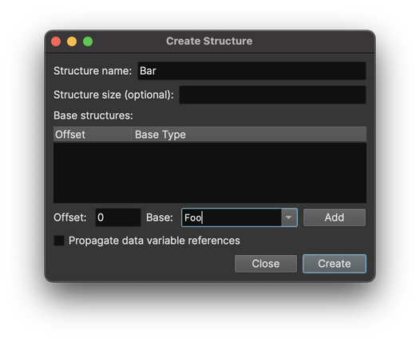
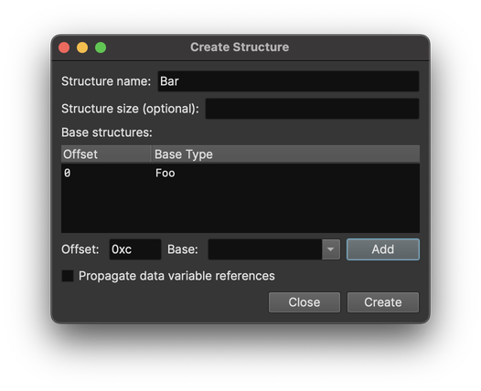
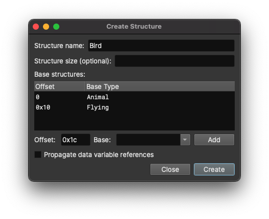
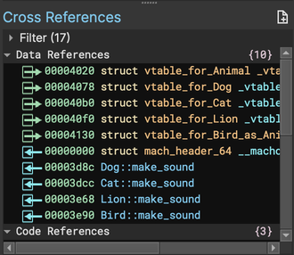

# Working with C++ Types and Virtual Function Tables

## Derived Classes

Structures in Binary Ninja can be derived from other structures, allowing C++ class hierarchies
to be represented without having to redefine base class members. Defining the class hierarchy
in Binary Ninja will also allow the cross references to reflect the hierarchy, such that
base class members are cross referenced in all derived classes automatically.

In-memory layout of C++ classes is not defined by the standard and varies by compiler, so Binary
Ninja provides a low-level representation for describing the class layout.

### Defining a Derived Class or Structure

A derived class can be defined using the Create Structure dialog. From the Types sidebar this
dialog can be opened with a default hotkey of `s` or by using the add menu on the right of
the sidebar.


First, enter the offset and name of the base structure below the "Base structures" list. The
offset should be where in the derived structure to place the base structure's members, which
will usually be zero for single inheritance.



Click the add button to add the base structure to the new structure.



The offset will automatically update to be just after the added structure in case you need to
add additional base structures. Click the Create button to create the new structure.

The new structure will appear in the types sidebar with special syntax to show the base
structures and the inherited members:

``` C
struct __base(Foo, 0) Bar __packed
{
    __inherited int32_t Foo::field_0;
    __inherited int32_t Foo::field_4;
    __inherited int32_t Foo::field_8;
};
```

This syntax can also be used in the Create Types interface to create derived structures
from C source. When creating types from the Create Types interface, `__inherited` members
need only match the structure's size and can be more easily defined like this:

``` C
struct __base(Foo, 0) Bar
{
    __inherited Foo foo;
};
```

Derived structures can also be defined using the API. Use the `base_structures` property of
the structure builder to do this. It takes a list of `BaseStructure` objects, which are defined
using a `Type` and an offset.

``` python
s = TypeBuilder.structure()
s.base_structures = [BaseStructure(bv.types['Foo'], 0)]
```

## Virtual Function Tables

Virtual functions are implemented by compilers using a virtual function table structure that is
pointed to by instances of the class. The layout of these structures is compiler dependent, so
when reverse engineering a C++ binary these structures must be created to match the in-memory
layout used by the binary.

One of the most common tasks when reversing a C++ binary is discovering which functions a virtual
function call can resolve to. Binary Ninja provides a "propagate data variable references"
option in the Create Structure dialog to help with this. When this is enabled, pointers
found in the data section that are part of any instance of the structure will be considered
as cross references of the structure field itself. This allows you to click on the name of a
virtual function and see which functions it can potentially call in the cross references view.

### Defining a virtual function table

To create a virtual function table, select the "propagate data variable references" option when
creating the structure in the Create Structure dialog. Alternatively, use the `__data_var_refs`
or `__vtable` attributes (these are aliases of each other) when creating the structure from
C source. Here is an example virtual function table structure:

``` C
struct __data_var_refs vtable_for_Foo
{
    void (* fizz)(struct Foo* this);
    void (* buzz)(struct Foo* this);
};
```

Now, apply the new virtual function table structure to each instance of the table in the data
section. You can usually find pointers to them in the constructors.

### Derived virtual function tables

Virtual functions are typically used in conjunction with derived classes. In order to get the
best results from Binary Ninja, each class should have its own virtual function table structure,
and the virtual function table structures should use the base structures feature described
earlier to mirror the class hierarchy. For example, if the class `Foo` mentioned in the virtual
function table above has a derived class of `Bar`, you would define a second virtual function
table structure `vtable_for_Bar` that derives from `vtable_for_Foo`:

``` C
struct __base(vtable_for_Foo, 0) __data_var_refs vtable_for_Bar
{
    __inherited void (* vtable_for_Foo::fizz)(struct Foo* this);
    __inherited void (* vtable_for_Foo::buzz)(struct Foo* this);
    void (* beep)(struct Bar* this);
};
```

You should always define these derived virtual function table structures, even if they have the
same members. This allows Binary Ninja to get more accurate results.

The last step is to ensure that the virtual function tables are pointed to correctly in the
class itself. This is often the first member of the structure. Make sure that each class points
to its own virtual function table structure. Derived structure members can be overridden simply
by changing their type.

The example `Foo` and `Bar` classes would look like this:

``` C
struct Foo
{
    struct vtable_for_Foo* vtable;
    // Foo members
};

struct __base(Foo, 0) Bar
{
    struct vtable_for_Bar* vtable; // Overridden Foo::vtable
    // __inherited Foo members
    // Additional Bar members
};
```

???+ Warning "Tip"
    Do not leave the `vtable` members deriving from the base class. You should always make a
    derived virtual function table structure for each new class, and override the `vtable`
    member to point at the corresponding structure. This will significantly improve Binary
    Ninja's cross references for virtual function calls.

## Example

Consider the following C++ program:

``` C++
class Animal
{
public:
    const char* name;

    virtual void make_sound() = 0;

    virtual void approach()
    {
        make_sound();
    }

    void greet()
    {
        printf("You:\n");
        printf("Hello %s!\n", name);
        printf("%s:\n", name);
        make_sound();
    }
};

class Flying
{
public:
    int max_airspeed;

    virtual void fly()
    {
        puts("Up, up, and away!");
    }
};

class Dog: public Animal
{
public:
    int bark_count;

    virtual void make_sound() override
    {
        puts("Woof!");
        bark_count++;
    }
};

class Cat: public Animal
{
public:
    int nap_count;

    virtual void make_sound() override
    {
        puts("Meow!");
    }

    virtual void approach() override
    {
        if (nap_count)
            puts("Zzzz...");
        else
            make_sound();
    }

    virtual void nap()
    {
        nap_count++;
    }
};

class Lion: public Cat
{
public:
    virtual void make_sound() override
    {
        puts("Roar!");
    }
};

class Bird: public Animal, public Flying
{
public:
    int song_length;

    virtual void make_sound() override
    {
        for (int i = 0; i < song_length; i++)
            puts("Tweet!");
    }

    virtual void approach() override
    {
        fly();
    }
};
```

### Defining the base classes

First, we define the base classes `Animal` and `Flying`. We leave the `vtable` member as a `void*`
for now, since we will need these structures defined first:

``` C
struct Animal
{
    void* vtable;
    char* name;
};

struct Flying
{
    void* vtable;
    int32_t max_airspeed;
};
```

We can use these structures in the member functions to see better results in the decompiler:

``` C
int64_t Animal::greet(struct Animal* this)
{
    _printf("You:\n");
    _printf("Hello %s!\n", this->name);
    _printf("%s:\n", this->name);
    return *(int64_t*)this->vtable();
}
```

???+ Warning "Tip"
    `this` is a keyword in the type parser, so if you try to define the function prototype with
    `this` as the name of a parameter, you will get an error. You can enclose the parameter name
    with backticks to work around this. Here, the parameter declaration would need to be
    ``Animal* `this` `` to pass the type parser.

### Defining the derived classes

The `Dog`, `Cat`, and `Lion` classes can be defined by using the [derived structure feature](#defining-a-derived-class-or-structure), with the base class at offset zero. These classes
will look like this at this point:

``` C
struct __base(Animal, 0) Dog
{
    __inherited void* Animal::vtable;
    __inherited char* Animal::name;
    int32_t bark_count;
};

struct __base(Animal, 0) Cat
{
    __inherited void* Animal::vtable;
    __inherited char* Animal::name;
    int32_t nap_count;
};

struct __base(Cat, 0) Lion
{
    __inherited void* Animal::vtable;
    __inherited char* Animal::name;
    __inherited int32_t Cat::nap_count;
};
```

Applying these structures to the parameter types will improve decompilation of these classes:

``` C
void Dog::make_sound(struct Dog* this)
{
    _puts("Woof!");
    this->bark_count = (this->bark_count + 1);
}

void Cat::nap(struct Cat* this)
{
    this->nap_count = (this->nap_count + 1);
}
```

### Multiple inheritance

The `Bird` class derives from both `Animal` and `Flying`. The typical in-memory layout of this
class is to place `Animal` at offset zero, `Flying` just after `Animal`, and any members from
the derived class after both. We set up this structure in the Create Structure dialog by first
adding `Animal` as a base structure and then adding `Flying`. The Create Structure dialog will
automatically adjust the offset as you add structures. The dialog should look like this after
the base structures are added:



After defining and adding the additional member, the `Bird` structure looks like this:

``` C
struct __base(Animal, 0) __base(Flying, 0x10) Bird
{
    __inherited void* Animal::vtable;
    __inherited char* Animal::name;
    __inherited void* Flying::vtable;
    __inherited int32_t Flying::max_airspeed;
    int32_t song_length;
};
```

### Base class virtual function tables

Now it is time to start adding the virtual function tables, starting with the base classes.
Add the virtual function table structures for `Animal` and `Flying`. Ensure to check the
"propagate data variable references" option when creating any virtual function table. The
virtual function table structures will look like this:

``` C
struct __data_var_refs vtable_for_Animal
{
    void (* make_sound)(struct Animal* this);
    void (* approach)(struct Animal* this);
};

struct __data_var_refs vtable_for_Flying
{
    void (* fly)(struct Flying* this);
};
```

Change the `vtable` members in the base classes to point to the virtual function table
structures:

``` C
struct Animal
{
    struct vtable_for_Animal* vtable;
    char* name;
};

struct Flying
{
    struct vtable_for_Flying* vtable;
    int32_t max_airspeed;
};
```

Now, go to the data section and apply the virtual function table structures to the
virtual function tables themselves:

``` C
00004020  struct vtable_for_Animal _vtable_for_Animal = 
00004020  {
00004020      void (* make_sound)(struct Animal* this) = nullptr
00004028      void (* approach)(struct Animal* this) = Animal::approach()
00004030  }

00004050  struct vtable_for_Flying _vtable_for_Flying = 
00004050  {
00004050      void (* fly)(struct Flying* this) = Flying::fly
00004058  }
```

### Derived class virtual function tables

The virtual function tables for the derived classes should be derived from the virtual
function tables for the base classes using the
[derived structure feature](#defining-a-derived-class-or-structure). Define the
`Dog` and `Cat` virtual function tables with a base of `vtable_for_Animal`:

``` C
struct __base(vtable_for_Animal, 0) __data_var_refs vtable_for_Dog
{
    __inherited void (* vtable_for_Animal::make_sound)(struct Animal* this);
    __inherited void (* vtable_for_Animal::approach)(struct Animal* this);
};

struct __base(vtable_for_Animal, 0) __data_var_refs vtable_for_Cat
{
    __inherited void (* vtable_for_Animal::make_sound)(struct Animal* this);
    __inherited void (* vtable_for_Animal::approach)(struct Animal* this);
    void (* nap)(struct Cat* this);
};
```

Define the `Lion` virtual function table with a base of `vtable_for_Cat`:

``` C
struct __base(vtable_for_Cat, 0) __data_var_refs vtable_for_Lion
{
    __inherited void (* vtable_for_Animal::make_sound)(struct Animal* this);
    __inherited void (* vtable_for_Animal::approach)(struct Animal* this);
    __inherited void (* vtable_for_Cat::nap)(struct Cat* this);
};
```

Change the `vtable` inherited members in the derived classes to point to the correct
virtual function table structure for that class:

``` C
struct __base(Animal, 0) Dog
{
    struct vtable_for_Dog* vtable;
    __inherited char* Animal::name;
    int32_t bark_count;
};

struct __base(Animal, 0) Cat
{
    struct vtable_for_Cat* vtable;
    __inherited char* Animal::name;
    int32_t nap_count;
};

struct __base(Cat, 0) Lion
{
    struct vtable_for_Lion* vtable;
    __inherited char* Animal::name;
    __inherited int32_t Cat::nap_count;
};
```

Apply the new virtual function table structures to the virtual function tables in
the data section:

``` C
00004078  struct vtable_for_Dog _vtable_for_Dog = 
00004078  {
00004078      void (* make_sound)(struct Animal* this) = Dog::make_sound()
00004080      void (* approach)(struct Animal* this) = Animal::approach()
00004088  }

000040b0  struct vtable_for_Cat _vtable_for_Cat = 
000040b0  {
000040b0      void (* make_sound)(struct Animal* this) = Cat::make_sound
000040b8      void (* approach)(struct Animal* this) = Cat::approach()
000040c0      void (* nap)(struct Cat* this) = Cat::nap()
000040c8  }

000040f0  struct vtable_for_Lion _vtable_for_Lion = 
000040f0  {
000040f0      void (* make_sound)(struct Animal* this) = Lion::make_sound
000040f8      void (* approach)(struct Animal* this) = Cat::approach()
00004100      void (* nap)(struct Cat* this) = Cat::nap()
00004108  }
```

At this point virtual method calls in the decompilation should start looking more correct:

``` C
int64_t Animal::greet(struct Animal* this)
{
    _printf("You:\n");
    _printf("Hello %s!\n", this->name);
    _printf("%s:\n", this->name);
    return this->vtable->make_sound();
}
```

### Virtual function tables with multiple inheritance

The `Bird` class is derived from both `Animal` and `Flying`, so it has two different virtual function
tables, one for each base class. Define both virtual function table structures, each deriving from
the base class that it came from:

``` C
struct __base(vtable_for_Animal, 0) __data_var_refs vtable_for_Bird_as_Animal
{
    __inherited void (* vtable_for_Animal::make_sound)(struct Animal* this);
    __inherited void (* vtable_for_Animal::approach)(struct Animal* this);
};

struct __base(vtable_for_Flying, 0) __data_var_refs vtable_for_Bird_as_Flying
{
    __inherited void (* vtable_for_Flying::fly)(struct Flying* this);
};
```

There were two inherited `vtable` members in the `Bird` structure. Replace the types of these with
the new derived virtual function table types:

``` C
struct __base(Animal, 0) __base(Flying, 0x10) Bird
{
    struct vtable_for_Bird_as_Animal* animal_vtable;
    __inherited char* Animal::name;
    struct vtable_for_Bird_as_Flying* flying_vtable;
    __inherited int32_t Flying::max_airspeed;
    int32_t song_length;
};
```

Apply the virtual function table structures to the corresponding virtual function tables in the
data section:

``` C
00004130  struct vtable_for_Bird_as_Animal _vtable_for_Bird_as_Animal = 
00004130  {
00004130      void (* make_sound)(struct Animal* this) = Bird::make_sound()
00004138      void (* approach)(struct Animal* this) = Bird::approach()
00004140  }

00004150  struct vtable_for_Bird_as_Flying _vtable_for_Bird_as_Flying = 
00004150  {
00004150      void (* fly)(struct Flying* this) = Flying::fly
00004158  }
```

Now the decompiler is able to determine the destination of a virtual function call in `Bird`:

``` C
void Bird::approach(struct Bird* this)
{
    this->flying_vtable->fly(&this->flying_vtable);
}
```

The transformation on the `this` parameter is the compiler obtaining a pointer to `Flying` from
the `Bird` instance so that it can be used by the `Flying` class.

### Cross references

Now that the data structures have been set up, Binary Ninja can provide helpful cross references
when navigating the C++ program. For example, clicking on the `make_sound` member in the `Animal`
structure will populate the cross references view with the list of functions that implement the
method:



These cross references are aware of context when viewed from code. For example, in the following
function:

``` C
void Cat::approach(struct Cat* this)
{
    if (this->nap_count == 0)
    {
        this->vtable->make_sound();
    }
    else
    {
        _puts("Zzzz...");
    }
}
```

Clicking on `make_sound` will populate the cross references with *only* the functions that are
in `Cat` or derived classes of `Cat`:


## Offset Pointers

When implementing multiple inheritance, sometimes compilers will define a pointer to a class as
pointing into the middle of the memory layout of that class. If this is the case, you can use
the `__ptr_offset` attribute on a structure to tell Binary Ninja that pointers to the structure
are actually pointing at the given offset into the structure. For example, consider the following
definition:

``` C
struct __ptr_offset(4) Foo
{
    int fizz;
    int buzz;
};
```

When dereferencing `Foo*`, Binary Ninja will treat `buzz` as the member being pointed to, with
`fizz` being at offset `-4`.
